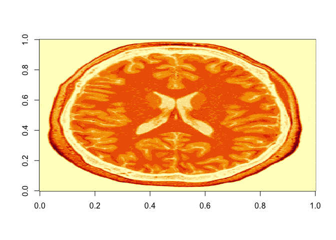
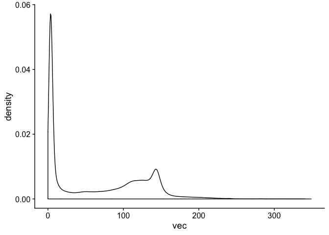

Tutorial
================
Go Ogata, Will Snyder

Importing Brain scan and Brain fold tracings
--------------------------------------------

the oro.nifiti package provides us a way to load the nifti files to R using the command readNIfTI. Additionally this command is able to read from g zipped (.gz) files too.

In this tutorial we will be using the brain scan file 'bias\_corrected.nii.gz' and Brain fold tracings file 'full\_orbital\_sulcus\_t1dim.nii.gz' located in the same file as the rmd file.

``` r
#scan <- readNIfTI(<nifti file location>)
scan <- readNIfTI('bias_corrected.nii.gz')
sulci <- readNIfTI('full_orbital_sulcus_t1dim.nii.gz')
```

Displaying the Data
-------------------

With the orthographic command from the previous package we are able to dispaly the brain scan in R. The image produced by the scan shows the

``` r
orthographic(scan)
```


``` r
#or
oro.nifti::image(scan[,,75])
```


But in most case the default setting of centered in the middle file isn't enough. To move the access you can use the add the flag xyz = (x-axis,y-axis,z-axis). The x-plane is shown on the top right, y-plane is shown on the top-left and the z-plane is shown on the bottom left and the red lines shows the location of the plane in the other two planes

``` r
# Editing the location of the Cross Section
orthographic(scan,xyz = c(125,125,125))
```


``` r
image(scan[,,130])
```


``` r
image(scan[,130,])
```


``` r
image(scan[130,,])
```


``` r
# Editing the settings for the Cross Hairs
orthographic(scan,crosshairs = F)
```


``` r
orthographic(scan,col.crosshairs = "blue")
```


``` r
oro.nifti::image(scan[,,130], col = gray(0:64/64))
```


Once we learned how to display the brain scans, and we can use the the command for orthographic or the overlay command to see one specific cross section for a better look.

``` r
orthographic(scan,y = sulci, col.y = "green", col.crosshairs = "red", c(125,225,75))
```


``` r
overlay(x = scan, y = sulci, z = 75, plot.type = "single", col.y = "green")
```


However, we forgot a step when editing the Brain Fold Tracing file. The NIfTI files are essentially 3-Dimensianal matrixes called Voxels and as of right now are large portions have a value of zero and the overlay is showing it with the solid green color. To fix this problem, you can edit the file so that every spot with a value of zero is changed to contain a NA so that the value becomes invisable for the overlay.

``` r
sulci[sulci == 0] = NA

orthographic(scan,y = sulci, col.y = "green", col.crosshairs = "red", c(125,225,75))
```


``` r
overlay(x = scan, y = sulci, z = 85, plot.type = "single", col.y = "green")
```


``` r
image(scan[,,130])
```



``` r
vec <- as.vector(scan)
```

``` r
scan[scan>80] = 3
scan[scan>80] = 1
image(scan[,,130])
```


``` r
ggplot() +
  geom_density( aes(x = vec)) +
  theme_cowplot()
```



Acknowledgements
================

1.<https://cran.r-project.org/web/packages/oro.nifti/oro.nifti.pdf> 2.
